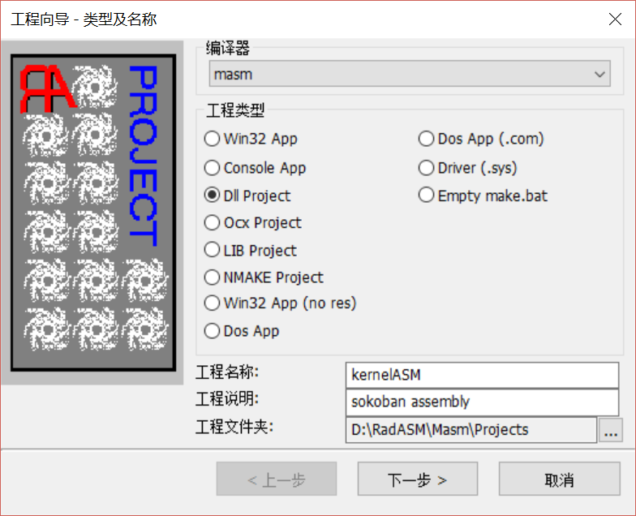
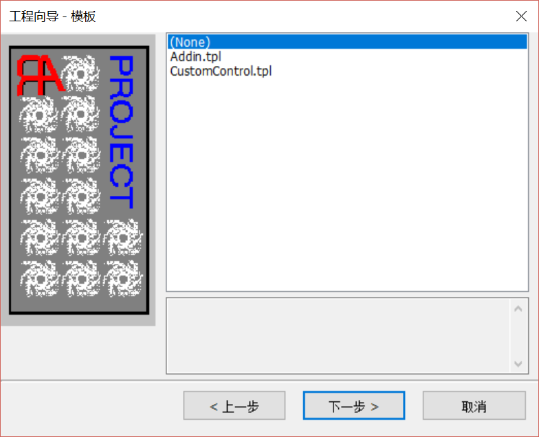
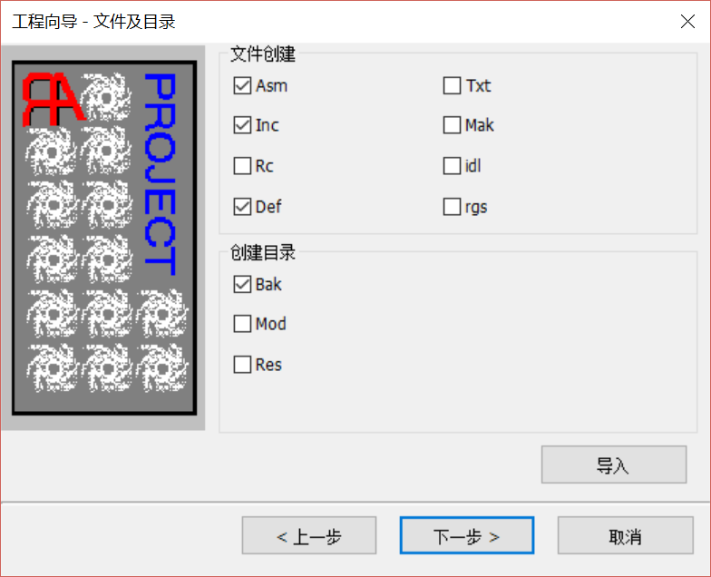
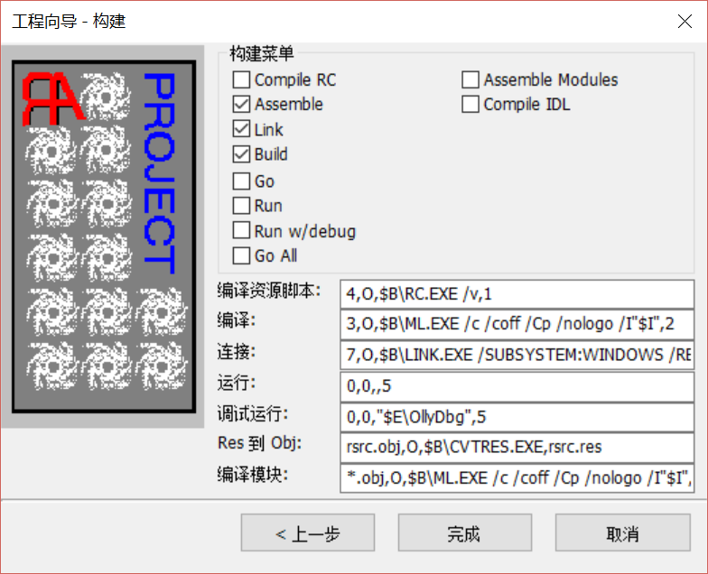
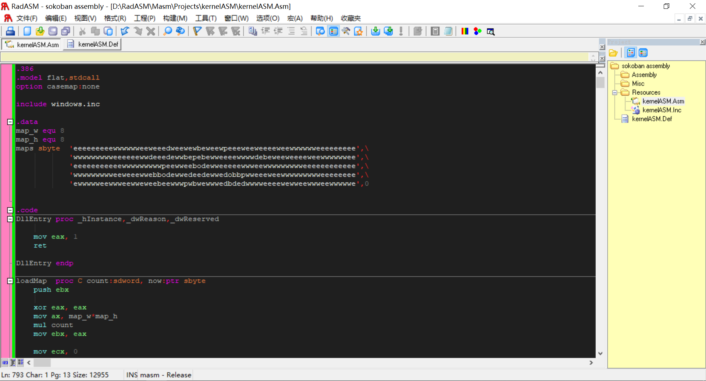
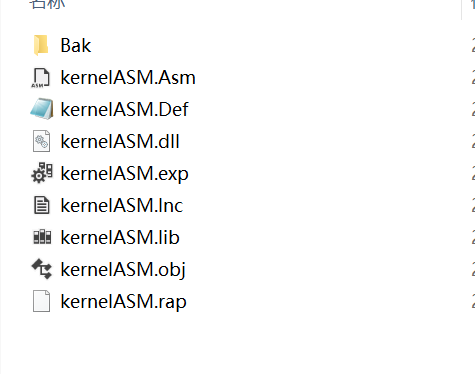
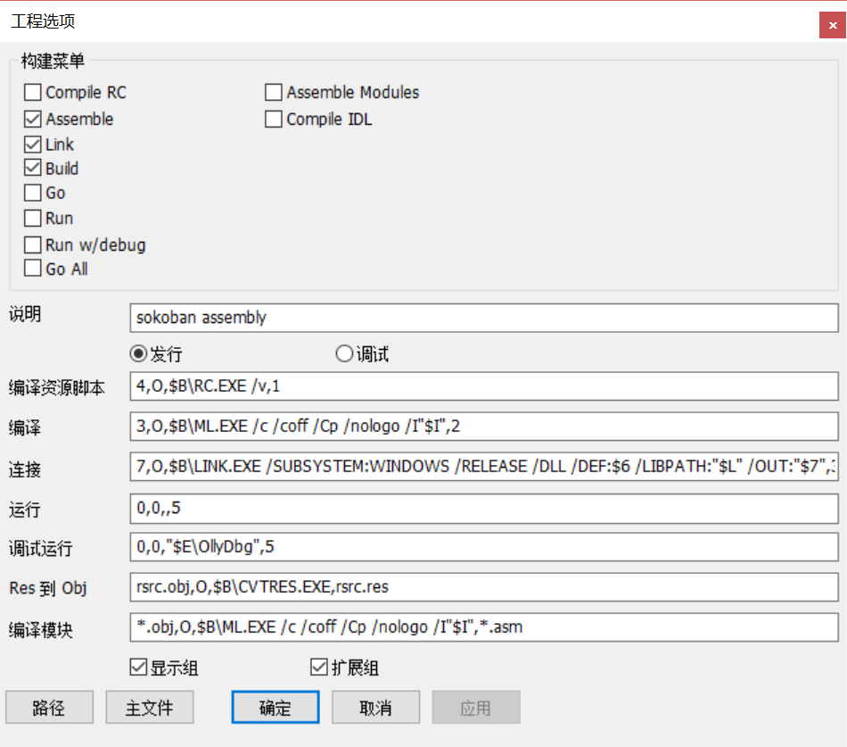

# kernelASM.asm 汇编代码说明及 dll文件生成

## 汇编代码说明
汇编代码中主要有六个函数，两个宏定义，两个字符数据。

宏定义：汇编使用 equ 伪指令指明宏定义（貌似不叫宏，但跟宏的作用类似）
```
map_w equ 8
map_h equ 8
```

字符数据：
```
filename db '.\map.txt',0   ;map.txt文件路径
mapF sbyte 331 dup(0)       ;存取读入文件内容，最多（64+2）*5=330个字符
```

六个函数：
- DllEntry ：dll入口，生成 dll 文件所必须的一个函数，与具体功能实现无关
- void loadMap(int count, char * now) ：加载地图函数，传入count指明加载地图编号，now是一个字符指针存放加载的地图。该函数通过读取文件，将文件中的字符读入并传给now变量实现加载地图功能。
- int moveUp(char * now) ：上移操作，人物向上移动则调用此函数，函数对传入的地图进行相应修改，返回值指明本次操作后此关是否通过
- int moveDown(char * now) ：下移操作，人物向下移动则调用此函数，函数对传入的地图进行相应修改，返回值指明本次操作后此关是否通过
- int moveLeft(char * now) ：左移操作，人物向左移动则调用此函数，函数对传入的地图进行相应修改，返回值指明本次操作后此关是否通过
- int moveRight(char * now) ：右移操作，人物向右移动则调用此函数，函数对传入的地图进行相应修改，返回值指明本次操作后此关是否通过

此外，代码内部还定义有一些辅助性函数，比如查找当前人物在地图中的坐标 findPerPos() ，判断此关是否通过 isSuccess()。

## map格式说明
定义在map.txt中的地图数据，一行数据共8*8个字符，代表一个地图的数据，maps最多定义五个地图。

每个地图数据中包含如下字符，且具体含义如下：
- e: empty 空地
- w: wall 墙
- d: destination 箱子目的地
- p: person 人
- b: box 箱子
- o: 箱子在目标点上
- t: 人在目标点上

## 汇编代码生成 dll 文件
汇编生成 dll 文件需要下载一个工具软件RadASM（VS貌似也可以但我不会！），网上搜一下就可找到。

具体步骤如下：

#### 1. 创建工程，选择编译器 masm，然后选择Dll project，填入工程名称和说明及文件夹。



#### 2. 下一步，默认



#### 3. 可以根据需求选择文件，一般默认即可



#### 4. 构建，可根据需求选择构建菜单或更改编译链接命令（也可稍后改），一般默认即可



#### 5. 进入主界面，在右侧列表找到你的.asm文件和.def文件，asm文件就是放的汇编代码，.def文件是放入导入函数的编写,如下（具体可参考kernelASM.asm和kernelASM.def）
```
EXPORTS	loadMap
		moveUp
		moveDown
		moveLeft
		moveRight
```



#### 6. 生成目标
上方工具栏中 “构建” 目录下：
- 构建->assembly ：编译
- 构建->link ：链接
- 构建->build ：生成dll及其他文件

然后在资源管理器中找到这个项目就可以在文件夹中发现生成好的dll文件。



#### 7.更改编译器和链接器路径
RadASM 默认ml编译器和link链接器在C:\masm32\，我们自己装可能有自己的路径，下面展示修改路径：

工程->工程选项->路径 修改编译器连接器路径，一般修改 $B 值，其他值需要改也可以改一下。

工程选项下可以根据自己需求修改编译链接命令。




